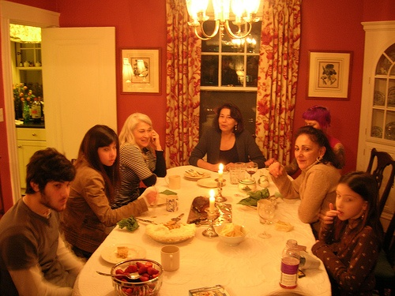
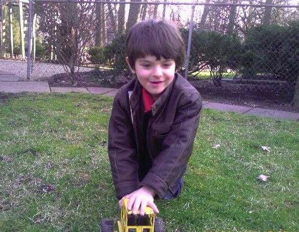
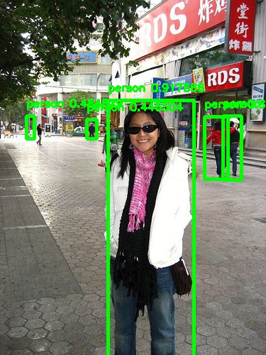
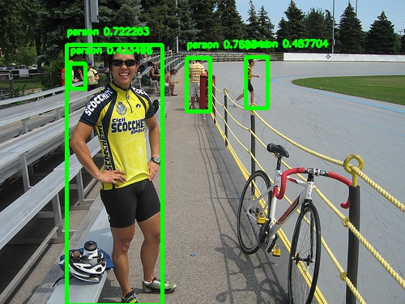

# Machine Learning Engineer Nanodegree
## Capstone Proposal and Capstone Project
## Project: Using the YOLO (You Look Only Once) Algorithm for People Detection

### Overview

Accurate and fast object detection is a domain which is continually being improved due to the many machine learning applications where it is applied. These areas encapsulate autonomous driving, video surveillance, and much more. This machine learning capstone project seeks to use object detection to identify people in a video stream. The goal is to develop an understanding of the current work being done in the field and implement the YOLO architecture on a specific problem, people detection. YOLO was documented with a frames per second (FPS) speed of 155 and mean average precision (mAP) of 52.7%. The goal of this project is to improve accuracy when implementing on one class, people, and show that the model can be retrained for a variety of different classes and / or objects. 

### YOLO Architecture

YOLO is a popular object detection algorithm allowing for real time object detection, but at the expense of accuracy. The model divides the image into a SxS grid and identifies B bounding boxes for each cell of the grid, with each box having a confidence value. Each cell of the grid is also assigned a class probability. Non-maximum suppression is then used to combine multiple bounding boxes which are identifying the same object. See image below for a visual of how the model operates. Find out more by reading the [paper](https://arxiv.org/pdf/1506.02640.pdf).

  

### Dataset

It was determined that images containing people from the Pascal VOC 2007 dataset would be used for training. The dataset contains 1070 images for training and 1025 images for validation containing people. Below is an example of the images found in the dataset. The dataset can be found [here](https://pjreddie.com/projects/pascal-voc-dataset-mirror/).

  

  

### Implementation

This project aimed to develop an object detection algorithm for identifying people in a video stream. Based on object detection research, it was determined that the YOLO model would be a good candidate for this application. The YOLO deep neural network was recreated in keras and weights from the original model were loaded. The last layer of the model was then modified, weights randomized, and the model was retrained on a new dataset containing only people. Originally the model gave too many false positives, but after refinement, the model proved to be successful in identifying people in a video stream. 

A big thank you to [experiencor](https://github.com/experiencor/keras-yolo2) for providing the baseline code for this project!

### Project Requirements

python 3.6.2

keras 2.2.0

imgaug

numpy

matplotlib

pickle

tqdm

tensorflow 1.5.1

opencv

### Project Files

**config.py** - This file contains all parameters for training, make edits as necessary. [More information available here](https://github.com/experiencor/keras-yolo2).

**yolo.py** - This file is for training the Yolo model in keras. You must define the paths for the training and validation images and annotation files (see Dataset section above). You must also define the path to the original YOLO weights, which can be downloaded [here](https://github.com/rodrigo2019/keras-yolo2/releases/tag/pre-trained-weights). You also need to define which file you would like to save the newly trained model weights to. 

**evaluate.py** - This file is for calculating the mean average precision on the validation dataset after the model has been developed. You must define the path to the validation images and annotation files. You must also define the name and path for the newly tranined model which you are evaluating. 

**predict.py** - This file is for implementing the model on a new image and / or video. You must define the name and path for the newly trained model and also the path to the image and / or video you are looking to predict, in addition to where you would like to save the predicted photo and / or video. Some sample data can be found in the [sample_data](https://github.com/cassiecarr/PersonDetection/tree/master/sample-data) folder of this repository. You can also download the model I developed [here](https://s3.amazonaws.com/persondetectionyolomodel/new_model_6.h5)

**custom_loss.py, preprocess.py, utils.py** - Supplemental files for the loss function, preprocessing functions, and bounding box functions.

### Conclusions

Overall, the model developed performed well on the trial images and videos containing people. The mean average precision (mAP) was calculated on the validation set and was found to be 65.96%. Below is an example of some images with the algorithm applied. You can also see a video I tested the algorithm on [here](https://youtu.be/6I3_GQn-evQ).

  

  

